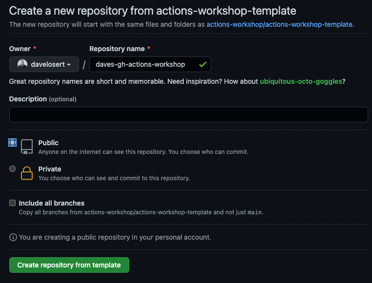

# CI/CD WorkShop 
> Spot issues quickly, save time and be thrifty

## Table of Contents 📑
- [CI/CD WorkShop](#cicd-workshop)
  - [Table of Contents 📑](#table-of-contents-)
  - [Introduction 📝](#introduction-)
  - [Dependencies 📦](#dependencies-)
  - [Getting Started 🚀](#getting-started-)
  - [Running the Application](#running-the-application)
    - [Other useful commands 🛠](#other-useful-commands-)
  - [CI/CD WorkShop](#cicd-workshop-1)
  - [References 📚](#references-)

## Introduction 📝

This workshop is designed to help you understand the importance of CI/CD and how to implement it in your project. We will be using [**GitHub Actions**](https://github.com/features/actions) to automate our CI/CD pipeline. 
In this workshop, we will Test, Build, validate and finally package the application in a Docker container. We will be able to run the packaged application using the docker container. 

We have provided a baseline CI for building and deploying the application, we invite you to choose one primary workshop goal and complete it. If you have time, you can complete the other goals or implement stretch goals as chosen by your team.

Following this workshop, you will create a set of GitHub Action workflows in order to **test, release, secure** and **deploy** the **Rocketdex** 🚀 - an awesome React-Application that lets you view and collect all your favorite rockets!

You will learn how to

- run your [**GitHub Actions**](https://github.com/features/actions)
- use [**the Marketplace**](https://github.com/marketplace)
- create a complete and secure **CI pipeline** from scratch

## Dependencies 📦
- [Node.js](https://nodejs.org/en/)
- [npm](https://www.npmjs.com/)
- [git](https://git-scm.com/)
- [GitHub Account](https://github.com)

## Getting Started 🚀

Anything you need for this workshop is contained within this template-repository - so the first thing you need to do is get a copy of it:

1. On the top right, click the green `Use this template` button
    
2. Give your new repository any name you like (for example `<team_name>-cicd-workshop`)
3. Decide for an owner of the new repository, use Indigo.
4. Make it a `Public` repository so you don't use up any of your private action minutes
5. Click `Create repository from template`



Now, you can start working on the [basics of the application](./docs/basics.md) by running it locally.

## Running the Application 

The **Rocketdex** application is a [React](https://reactjs.org/)-Application build with [vite](https://vitejs.dev/) and tested with [vitest](https://vitest.dev/).

You can simply clone it and install all dependencies using:

```sh
npm install
```

After that, you can start it in development mode to have a look at it:

```sh
npm run dev
```

You can experiment with the below command locally before moving to the Continous Integration and Continous Delivery part of the workshop.

### Other useful commands 🛠

| Description                                               | Command         |
| --------------------------------------------------------- | --------------- |
| Build and Bundle the App using [vite](https://vitejs.dev) | `npm run build` |
| Run Unit Tests with [vitest](https://vitest.dev/)         | `npm run test`  |
| Lint the Code with [ESLint](https://eslint.org/)          | `npm run lint`  |

## CI/CD WorkShop

Now that we have a working application, we can start building our CI/CD pipeline. 

- We will start by creating a very basic pipeline that will build and test our application by following the instructions found [here](./docs/ci.md).
- Now that we are building our application, it is time to deliver. We are will be packaging the application in a Docker Container to easily distribute it by [following these instructions](./docs/cd.md).
- Once we have a working pipeline, we can choose one of the following goals to complete the workshop:
  - **[QA & Test Coverage](./docs/qa.md)**
  - **[Security](./docs/security.md)**

## References 📚
- [Reference Workshop](https://github.com/actions-workshop/actions-workshopp)
- [ESLint Conventions](https://typescript-eslint.io/rules/naming-convention/)
